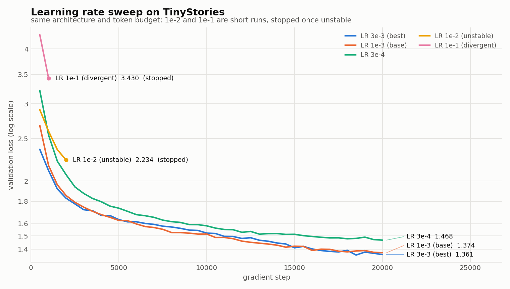
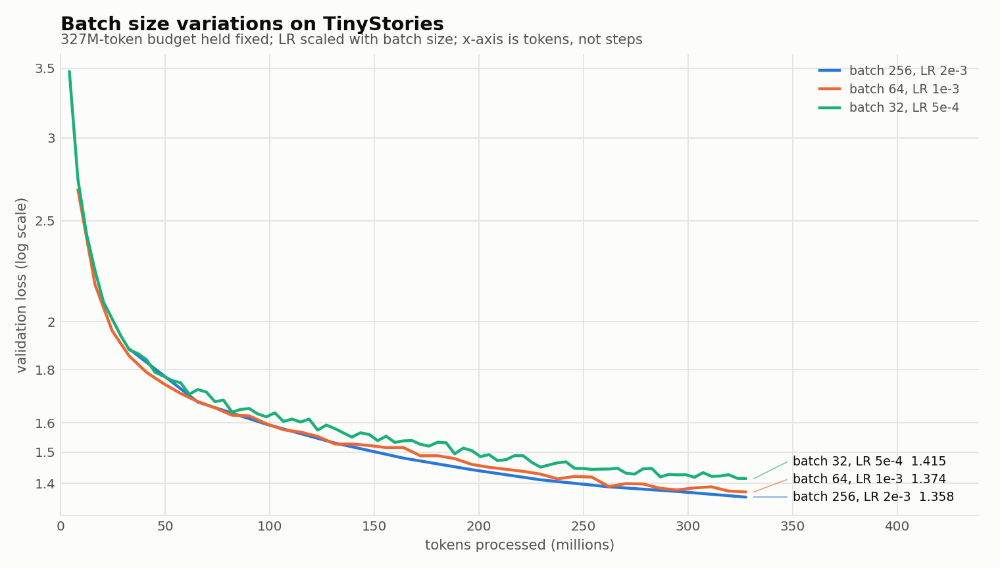
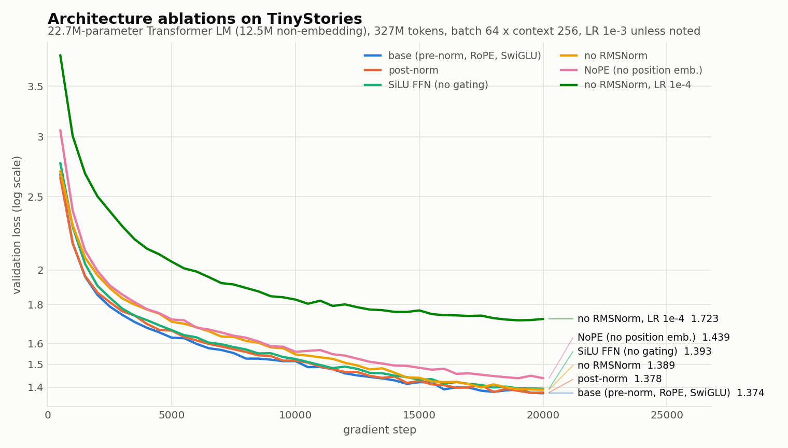

# Experiment log — TinyStories ablations, LR sweep, batch size

All runs use the same Transformer LM — `vocab 10,000`, `context 256`,
`d_model 512`, `d_ff 1344`, `4 layers`, `16 heads`, RoPE Θ=10,000, giving
**12.5M non-embedding / 22.7M total parameters** — on a
single RTX A6000, trained on 327,680,000 TinyStories tokens with AdamW
(β=(0.9, 0.95), weight decay 0.1, grad-clip 1.0), a cosine schedule with 5%
linear warmup, and `min_lr = 0.1 × max_lr`. Only the variable named in each
section changes.

Logging infrastructure: `cs336_basics/train.py` appends one JSON record per
event to `runs/<name>/log.jsonl` — training loss every 50 steps and validation
loss every 500 steps, each stamped with `step` and `wall_time` — and checkpoints
`latest.pt` / `best.pt` so runs survive interruption. Figures are regenerated
from those logs by `scripts/plot_curves.py`.

## Problem (experiment_log): all runs

| Run | Variable | Steps | Final val loss | Wall clock |
|---|---|---:|---:|---:|
| `tinystories-base` | baseline, LR 1e-3 | 20,000 | **1.374** | ~90 min |
| `lr-3e-4` | LR 3e-4 | 20,000 | 1.468 | 90 min |
| `lr-3e-3` | LR 3e-3 | 20,000 | **1.361** | 90 min |
| `lr-1e-2-divergent` | LR 1e-2 | 2,000 | 2.234 (unstable) | 9 min |
| `lr-1e-1-divergent` | LR 1e-1 | 1,000 | 3.430 (divergent) | 10 min |
| `batch-32` | batch 32, LR 5e-4 | 40,000 | 1.415 | ~118 min |
| `batch-256` | batch 256, LR 2e-3 | 5,000 | **1.358** | 88 min |
| `ablation-no-rmsnorm` | RMSNorm removed | 20,000 | 1.389 | 84 min |
| `ablation-no-rmsnorm-lowlr` | RMSNorm removed, LR 1e-4 | 20,000 | 1.723 | 84 min |
| `ablation-post-norm` | post-norm | 20,000 | 1.378 | 90 min |
| `ablation-nope` | NoPE (no position emb.) | 20,000 | 1.439 | ~86 min |
| `ablation-silu` | SiLU FFN, d_ff 2048 | 20,000 | 1.393 | 89 min |

Runs marked `~` were interrupted by a host session restart and resumed from
`latest.pt`; their wall clock is extrapolated from the observed seconds-per-step
of the longest uninterrupted segment, so it excludes the few hundred replayed
steps. Losses are unaffected — they are read from the final evaluation.

## Problem (learning_rate): Tune the learning rate

*(dark-mode version: `figures/lr_sweep_dark.png`)*

**Search strategy.** Logarithmic ladder around the 1e-3 baseline — one step down
(3e-4), one step up (3e-3), then two further steps up (1e-2, 1e-1) purely to
locate the instability boundary. Half-order-of-magnitude steps are the cheapest
way to bracket the optimum: the loss-vs-LR curve is smooth and roughly U-shaped,
so three points around a minimum are enough to tell whether the baseline was on
the low side or the high side. The upward runs were stopped early once the
trajectory was unambiguous rather than burning a full budget on a known failure.

| LR | Final val loss | Behaviour |
|---|---:|---|
| 3e-4 | 1.468 | converges, clearly under-trained at this budget |
| 1e-3 | 1.374 | converges (baseline) |
| **3e-3** | **1.361** | converges, best of the sweep |
| 1e-2 | 2.234 | unstable — loss bottoms at ~2.25 by step 1,750 then rises again |
| 1e-1 | 3.430 | divergent — never drops below ~3.4, loss oscillates upward |

**Target met:** the baseline (1.374), `lr-3e-3` (1.361) and `batch-256` (1.358)
all come in under the required TinyStories validation loss of 1.45.

Note the shape of the failure at high LR: it is not a `NaN` blow-up but a stall
followed by re-ascent — gradient clipping at 1.0 keeps the updates finite, so the
run degrades rather than crashing. The 1e-1 run is the clean divergence case.

## Problem (batch_size_experiment): Batch size variations

The token budget is held fixed at 327M, so step count moves inversely with batch
size (32 → 40,000 steps, 64 → 20,000, 256 → 5,000). Learning rate is scaled
roughly with batch size (5e-4 / 1e-3 / 2e-3), since the gradient-noise scale
grows with the batch and a larger batch tolerates — and needs — a larger step.

| Batch | LR | Steps | Final val loss | s/step | Throughput | Wall clock |
|---|---|---:|---:|---:|---:|---:|
| 32 | 5e-4 | 40,000 | 1.415 | 0.177 | 46.2k tok/s | ~118 min |
| 64 | 1e-3 | 20,000 | 1.374 | 0.269 | 61.0k tok/s | ~90 min |
| **256** | 2e-3 | 5,000 | **1.358** | 1.060 | 61.8k tok/s | 88 min |

**Findings.** At a fixed token budget, larger batches did better on both axes.

*Loss:* batch 256 reached the lowest validation loss of any TinyStories run and
batch 32 the worst of the three. The small-batch curve is visibly noisier in the
figure — each gradient estimate is a worse estimate of the true gradient, and the
LR reduction that keeps it stable also slows real progress per token.

*Throughput:* batch 64 and 256 are nearly tied (61.0k vs 61.8k tokens/s), meaning
the GPU is already saturated at batch 64 and the extra parallelism buys nothing
in speed. Batch 32, by contrast, drops to 46.2k tokens/s — 25% slower — because
per-step overhead (kernel launches, the optimizer step, data indexing) stops
being amortised. So there is a throughput floor below which shrinking the batch
is pure loss, and above saturation the benefit is statistical rather than
computational.

The usual caveat applies: this is a small model on an easy dataset, and past some
critical batch size the loss-per-token benefit disappears while memory cost keeps
growing — the practical ceiling then becomes GPU memory, not statistics.

## Problem (layer_norm_ablation): Remove RMSNorm

| Variant | Final val loss |
|---|---:|
| base (with RMSNorm), LR 1e-3 | 1.374 |
| RMSNorm removed, LR 1e-3 | 1.389 |
| RMSNorm removed, LR 1e-4 | 1.723 |

**What happens at the previous optimal LR.** Contrary to the usual expectation,
removing every RMSNorm did *not* destabilise training at LR 1e-3: the run
completed with a validation loss of 1.389, only 0.015 worse than the baseline,
with no loss spikes or `NaN`s. Three properties of this configuration explain the
robustness: the model is shallow (4 layers, so no deep signal-magnitude
compounding), gradient clipping at 1.0 caps the damage from any bad batch, and
warmup plus cosine decay keeps the effective step small early and late.

**Does a lower LR help?** No — it makes things much worse for a different
reason. At LR 1e-4 the un-normalised model reaches only 1.723, because the run is
now simply under-trained: the loss curve is still descending steeply at the end
of the budget. Since the LR 1e-3 run never needed rescuing, lowering the LR buys
stability that was not lacking and gives up convergence speed that was.

**Commentary on RMSNorm's impact.** At this depth RMSNorm is a mild optimisation
aid, not a prerequisite — worth ~0.015 validation loss. Its reputation as
essential comes from regimes this experiment does not reach: deeper stacks, larger
learning rates, no gradient clipping, and low-precision training, where
uncontrolled activation scale genuinely does break training.

## Problem (pre_norm_ablation): post-norm vs pre-norm

| Variant | Final val loss |
|---|---:|
| pre-norm (base) | 1.374 |
| post-norm | 1.378 |

Post-norm — applying RMSNorm *after* each residual addition
(`x = ln(x + attn(x))`) rather than inside the branch (`x = x + attn(ln(x))`) —
trained stably and finished essentially tied with pre-norm (+0.004). The two
curves are indistinguishable for most of training. This is consistent with the
RMSNorm ablation above: at 4 layers with warmup and gradient clipping, the
gradient-path advantage of pre-norm has almost nothing to bite on. Pre-norm's
documented benefits (tolerating higher LR, no warmup sensitivity, stability at
depth) are properties of larger models, so this result should not be read as
"post-norm is fine in general".

## Problem (no_pos_emb): NoPE vs RoPE

| Variant | Final val loss |
|---|---:|
| RoPE (base) | 1.374 |
| NoPE (no position information) | 1.439 |

Removing RoPE entirely costs 0.065 validation loss — the largest architectural
gap in this ablation set, and visible as a cleanly separated curve from about
step 3,000 onward. Note that NoPE still learns a great deal (1.439 is well below
the 1.468 of the LR 3e-4 run): a causal decoder is not permutation-invariant,
because each position attends to a different-sized prefix, so depth alone lets
the model infer approximate position. Explicit relative position information via
RoPE is nevertheless worth more than any of the other single components tested.

## Problem (swiglu_ablation): SwiGLU vs SiLU

| Variant | d_ff | FFN params/layer | Final val loss |
|---|---:|---:|---:|
| SwiGLU (base) | 1,344 | 2.06M | 1.374 |
| SiLU, non-gated | 2,048 | 2.10M | 1.393 |

`d_ff` was raised from 1,344 to 2,048 for the SiLU variant so the two FFNs have
matched parameter counts (2.10M vs 2.06M per layer): SwiGLU needs three
projections (`W1`, `W3` gate, `W2` down) where the plain SiLU FFN needs two, so
comparing at equal `d_ff` would have handed SwiGLU 50% more FFN parameters and
made the comparison meaningless.

**Findings.** At matched parameter count SwiGLU wins by 0.019 validation loss —
a real but modest margin, in the same range as the RMSNorm ablation and well
short of the RoPE gap. The gating mechanism therefore does buy something beyond
raw capacity: the multiplicative interaction `SiLU(W1 x) ⊙ W3 x` lets the layer
suppress or pass features per-dimension, which a single non-gated projection
cannot express. That the effect is small at this scale matches the literature's
own framing — Shazeer reported consistent but not dramatic gains, with no
mechanistic explanation offered. The cost of the win is a third weight matrix and
therefore a wider optimizer state, which is why the comparison must be run at
equal parameters and not equal `d_ff`.
