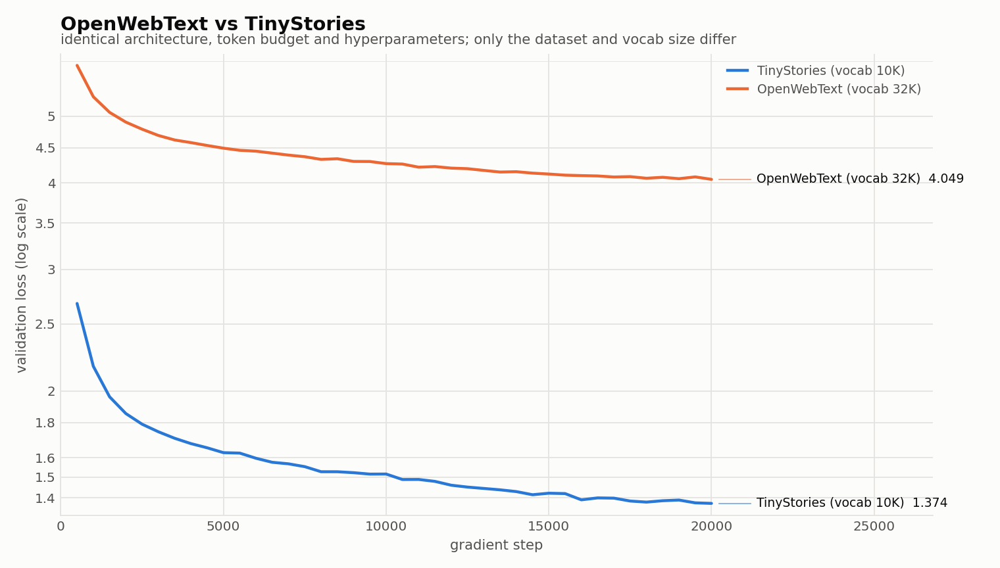

# Problem (main_experiment): Experiment on OpenWebText

## Setup

Identical architecture, token budget and hyperparameters to the TinyStories
baseline — `context 256`, `d_model 512`, `d_ff 1344`, `4 layers`, `16 heads`,
RoPE Θ=10,000, batch 64, LR 1e-3 with 5% warmup and cosine decay, AdamW
β=(0.9, 0.95), weight decay 0.1, grad-clip 1.0, 327,680,000 tokens over 20,000
steps. The only differences are the dataset and the tokenizer vocabulary
(32,000 instead of 10,000), which grows the embedding and LM head: **45.2M total
parameters instead of 22.7M**, with the 12.5M non-embedding parameters identical.

Data: the provided OpenWebText sample, BPE-trained to 32K vocab and encoded to
`uint16` — **2,727,120,452 train tokens** and 66,401,098 validation tokens
(vs 540,796,778 / 5,461,210 for TinyStories).

## Result

**Final validation loss: 4.049** (perplexity ≈ 57.4), versus **1.374**
(perplexity ≈ 3.95) for TinyStories under the same budget.

*(dark-mode version: `figures/owt_vs_tinystories_dark.png`)*

## Describing the difference in losses

The gap is large — 2.68 nats, a ~15× difference in perplexity — and almost all of
it reflects the difficulty of the data rather than a defect in training. Four
things drive it:

1. **Entropy of the text itself.** TinyStories is synthetic, generated by GPT-4
   under instructions to use a small vocabulary and simple sentence structure. Its
   next-token distribution is genuinely low-entropy: given "Once upon a time,
   there was a little", the continuation is nearly determined. OpenWebText is
   scraped web prose spanning news, forums, blogs and boilerplate; the next token
   is frequently unpredictable in principle, so a large part of the 4.049 is
   irreducible entropy that no model of any size would remove.
2. **Vocabulary and domain breadth.** A 10K vocabulary suffices to cover
   TinyStories almost perfectly, whereas the 32K OWT vocabulary still spreads
   probability mass over far more plausible candidates at each step, and the corpus
   contains named entities, code, URLs and markup that appear a handful of times
   each.
3. **Tokens-per-parameter.** The same 327M-token budget is a much larger fraction
   of TinyStories (0.6 epochs of its 541M-token train set) than of OpenWebText
   (0.12 epochs of 2.73B tokens). The OWT model is far more under-trained relative
   to what its data could teach it — and, unlike the TinyStories run, its loss curve
   is still descending at the end of the budget rather than flattening.
4. **Model capacity.** 12.5M non-embedding parameters is enough to model
   TinyStories' narrow distribution well, but nowhere near enough for web text. The
   TinyStories curve flattens because the model has largely fit its data; the OWT
   curve flattens because capacity and budget both bind.

The practical reading: **loss values are only comparable within a dataset.** 4.049
on OWT is a reasonable result for this size and budget (comfortably under the
5.0 naive baseline the handout cites), while 1.374 on TinyStories reflects a
much easier target, not a better model.

## Generated text

Prompt `"The future of artificial intelligence"`, `temperature=0.8`,
`top_p=0.9`, 300 new tokens (raw dump in `07_owt_generation_sample.txt`):

> The future of artificial intelligence is the absolute right of the NSA to be a free-market social network. It is a good idea to be proud of how a government works.
>
> The government has been in touch with the NSA, but there is a massive national program that has never been embraced by the government. But this week, I think the NSA has changed the fundamental rights of its citizens and the public. I think the NSA has been the slowest of the American government ever since. The way that we've always had a great deal of policy in the past, is that we have some good decisions that we can do what we need to do.
>
> I think the intelligence community needs to be focused on how to do it. If the intelligence community is going to be "any of them" it's going to be "we need to do the same thing" and we need to think that we're going to be in a better place.
>
> The NSA has made the government policy great, and it has to do with that. So far, there are enough ways to look at how they can communicate to the NSA. And it's important that the government is very happy to see it go through. So much of that is in the United States, as opposed to protecting our privacy.
>
> But the government should be working to maintain it. And they should be able to do it again.
>
> The NSA has also been going through the very same goals. The NSA had

**Comment on fluency.** Local fluency is good and clearly better than the loss
number alone suggests: the grammar is correct, the register is consistent
journalistic/op-ed prose, paragraph breaks land in sensible places, quotation
marks and typographic apostrophes are used correctly, and the model holds a topic
(surveillance policy, the NSA) across several paragraphs — it even picked a
coherent topic from a prompt about AI, which is a plausible web-text association.

What it lacks is **semantic coherence beyond the sentence**. Sentences are locally
well-formed but do not compose into an argument: claims contradict each other
("the absolute right of the NSA to be a free-market social network"), pronoun
referents drift, and several sentences are content-free connective filler ("we
need to do what we need to do"). This is the signature of a model that has
learned syntax and topical co-occurrence but not enough to track propositions.

Contrast with the TinyStories sample (`05_generate.md`), which is coherent
end-to-end: same architecture and budget, but the target distribution is simple
enough that 12.5M non-embedding parameters can model it at the discourse level.
The two factors
that matter most here are **the entropy of the training distribution** and the
**capacity/budget available relative to it** — the same two that explain the loss
gap above.
